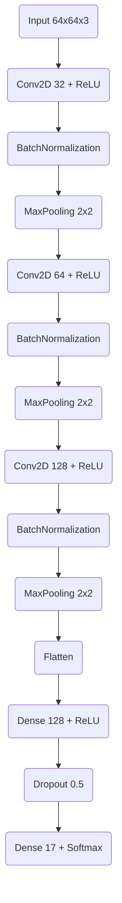

# 🌾 Jute Pest Detection using Transfer Learning & Custom CNN

An AI-based pest detection system for jute crops comparing fine-tuned pre-trained models (VGG19, InceptionV3, DenseNet201) against a lightweight Custom CNN to identify 17 different pest types.

## 🎯 Overview

Automated jute pest identification system designed to help farmers make informed pest management decisions. This project explores both heavy transfer learning architectures and a custom lightweight Convolutional Neural Network optimized for smaller input sizes ($64\times64$).

## ✨ Features

  - **Multi-Model Approach**: Comparison between VGG19, InceptionV3, DenseNet201, and a Custom CNN.
  - **17 Pest Classes**: Detects pests including Jute Aphid, Jute Hairy, Semilooper, and Termites.
  - **Data Augmentation**: Uses rotation, zoom, shear, and flips to improve generalization.
  - **Custom Optimization**: Implements `ReduceLROnPlateau` and `EarlyStopping` to prevent overfitting.
  - **Evaluation**: Detailed confusion matrices and classification reports for all models.

## 📊 Results

| Model | Accuracy | Precision | Recall | F1-Score |
| :--- | :--- | :--- | :--- | :--- |
| **DenseNet201** | **96%** | **96%** | **96%** | **96%** |
| InceptionV3 | 92% | 92% | 92% | 92% |
| VGG19 | 84% | 84% | 84% | 85% |
| **Custom CNN** | 78% | 82% | 78% | 77% |


## 📦 Installation

1.  **Clone the repository:**

    ```bash
    git clone https://github.com/Ravindu-Kuruppuarachchi/Jute-Pest.git
    cd Jute-Pest
    ```

2.  **Install dependencies:**

    ```bash
    pip install tensorflow opencv-python matplotlib scikit-learn pandas ucimlrepo
    ```

## 📁 Dataset Structure

The project expects the following directory structure:

```text
Jute_Pest_Dataset/
├── train/  # (17 class folders)
├── val/    # (17 class folders)
└── test/   # (17 class folders)
```

**Dataset Source**: [Kaggle - Jute Pest Dataset](https://www.kaggle.com/datasets/simulhasantalukder/jutepestindentification)

## 🧠 Model Architectures

### 1\. Custom CNN Architecture A lightweight model designed for $64\times64$ pixel inputs:



### 2\. Transfer Learning (VGG19, InceptionV3, DenseNet)

Uses pre-trained ImageNet weights with a custom classification head:

  * Base Model (frozen/unfrozen) $\rightarrow$ Global Average Pooling $\rightarrow$ Dropout (0.3) $\rightarrow$ Dense (17)

## ⚙️ Key Parameters (Custom CNN)

```python
IMG_HEIGHT = 64
IMG_WIDTH = 64
BATCH_SIZE = 32
EPOCHS = 30
LEARNING_RATE = 0.001 (with Decay)
```

## 📝 Usage Example

### Training the Custom CNN

```python
import tensorflow as tf
from tensorflow.keras import layers, models

# 1. Define the model
model = models.Sequential([
    layers.Conv2D(32, (3,3), activation='relu', input_shape=(64, 64, 3)),
    layers.BatchNormalization(),
    layers.MaxPooling2D((2,2)),
    
    layers.Conv2D(64, (3,3), activation='relu'),
    layers.BatchNormalization(),
    layers.MaxPooling2D((2,2)),
    
    layers.Conv2D(128, (3,3), activation='relu'),
    layers.BatchNormalization(),
    layers.MaxPooling2D((2,2)),
    
    layers.Flatten(),
    layers.Dense(128, activation='relu'),
    layers.BatchNormalization(),
    layers.Dropout(0.5),
    layers.Dense(17, activation='softmax')
])

# 2. Compile
model.compile(optimizer='adam', 
              loss='categorical_crossentropy', 
              metrics=['accuracy'])

# 3. Train (Assuming train_generator and val_generator are defined)
history = model.fit(train_generator, validation_data=val_generator, epochs=30)
```

## 📂 Output Files
  - `CustomCNN.ipynb`: Complete training pipeline for the custom model.
  - `pre-trained CNN.ipynb`: Training pipeline for VGG19/Inception.
  - `pre-trained CNN DenseNet.ipynb`: Training pipeline for DenseNet.

## 🐛 Troubleshooting

  * **Low Accuracy on Custom CNN?**
    The Custom CNN input size is currently set to `64x64`. Increasing this to `128x128` or `224x224` (if memory allows) may improve feature extraction accuracy to match transfer learning models.

  * **Overfitting?**
    The current model uses `Dropout(0.5)` and `EarlyStopping`. Ensure your validation set is representative of the test set.

